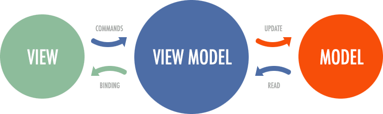
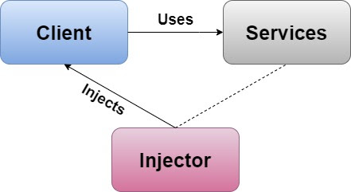

# Mobile WebSocketClient

The mobile application for this project was developed using Flutter. Flutter is an open-source software development kit (SDK) created by Google, designed to facilitate mobile application programming. This tool allows developers to build applications for multiple platforms and operating systems from the same codebase, describing the application's behavior in Dart, which is then compiled into native code (Kotlin or Java for Android, and Swift or Objective C for iOS).

## Architecture

For the application, we chose the MVVM architecture. The underlying idea behind this architecture is to separate the UI logic from the UI itself. The ViewModel contains the logic for a page and updates the UI (View) using models (Model).



## Dependency Injection

In this project, we followed the Dependency Injection design pattern, where an object receives the objects it depends on rather than constructing them. This strengthens separation of concerns, resulting in a loosely coupled and easily replaceable application.

The pattern ensures that when an object or class needs to use a service, it does not need to know how to construct it. The service is provided by an external piece of code called an injector, about which it does not need to know the details.

This pattern resolves three major issues in application design:

1. Classes are independent of the objects they use (avoiding complex inheritance structures).
2. The application and the objects/classes it uses are easily extensible and modifiable.
3. The behavior of a code fragment can be altered without modifying the code itself.




In this case, to avoid scenarios where a widget requires data from a distant ancestor (and needs to be passed through constructors), we built the project using the Injector package.

We initialized the Injector object in the application's main method within a private method and assigned it with instances of the navigator, WebSocket controller, and NotificationManager.

In the main method, we wrapped the application with a widget named MultiProvider. It takes a function as a parameter that returns an array of view models, which are then instantiated. The purpose of this widget is to make the application's main method more readable by converting the declaration tree of all view models in the application into a linear structure.

This way, each ViewModel has access to the Injector and can access whatever it needs. Additionally, all ViewModels extend a class named ChangeNotifier, which, in turn, extends Listenable. In other words, Views wait to be notified of changes that occurred in the ViewModel. This way, the decision to use resources to recreate the user interface is made by the logic code, i.e., the ViewModel.

## WebSocket Controller

The purpose of the mobile application is to interpret data coming from other modules. Hence, it is crucial for the socket between ESP and the application to be opened as quickly as possible, and in case of a lost connection, immediate attempts for reconnection should be made.

To describe this behavior, we implemented the WebSocketWrapper class. It has attributes: a WebSocket object and a Timer object. The constructor of this class is called during application initialization, immediately after instantiating the Injector. In this constructor, the _tryConnect() method is called for the first time. The goal of this method is to create and configure the connection with the server. The WebSocket class exposes a static connect() method, which takes the server address as a parameter and returns a Future<socket> (similar to JS Promise) if it connects successfully.

If the connection is successfully established, the WebSocket instance is stored in the WebSocketWrapper class attribute after adding the ping interval and setting the onMessage(), onDone(), and onError() callbacks.

If the connection cannot be established, a recursive call starts the process from the beginning. By setting the ping interval, we configured the client to check if the server responds. In case it sends a second ping without receiving a pong, the set callback in the constructor onDone is called, which calls _tryConnect() again to reestablish the connection.

Additionally, the WebSocketWrapper class is a Singleton. All ViewModels have access to the same instance of the socket and are notified when events are triggered.

The next step in the application's development was to find a method to notify the ViewModels and Views of socket events. We considered that the best solution would be to implement an Observer Pattern, different from the one in foundation.dart, for greater flexibility. In this way, ViewModels are notified of socket events, and the ViewModel's logic decides whether the user interface needs to be rebuilt.

For this purpose, we implemented the NotificationManager class, which is a Singleton (injected similarly to the socket wrapper) containing a list of NotificationObservers, which is an abstract class. This class contains only a String id and an update method, which takes a SocketNotification object as a parameter.

```dart
abstract class NotificationObserver {
  late String id;
  void update(SocketNotification notification);
}
```

The purpose of this class is to be implemented by each ViewModel that needs to be notified, and the update method is overridden by each ViewModel based on its graphical interface needs. The example below illustrates how to modify the color of the status dot in the application bar based on the socket state.

```dart
@override
void update(SocketNotification notification) {
  if (notification.connectionEstablished) {
    dotColor = Colors.green;
  } else {
    dotColor = Colors.red;
  }
  notifyListeners();
}
```

The WebSocketWrapper class notifies the observation subscribed to the NotificationManager's notifications, iterating through the entire list of observers and calling their update() method. The id attribute of the NotificationObserver class aims to improve notification performance in case they slow down the application. Instead of iterating through the entire list of observers, they could be held in a hash table and notified only when needed.

```dart
notifySubscribers(SocketNotification notification) {
  NotificationManager.instance.observers.forEach((e) {
    e.update(notification);
  });
}
```

Additionally, in cases where constant updates of the entire View are not necessary (Flutter's rerender algorithm does not rebuild components whose state has not changed), the foundation package provides a widget called ValueListenableBuilder. Its purpose is to listen for changes in a variable and, upon modification, to rebuild the child widget.

Due to the fact that the number of messages transmitted per second by the server should be as close as possible to the maximum screen refresh rate (60) to achieve real-time data interpretation, we considered it necessary to implement mechanisms to increase the application's performance from the very beginning if needed.
